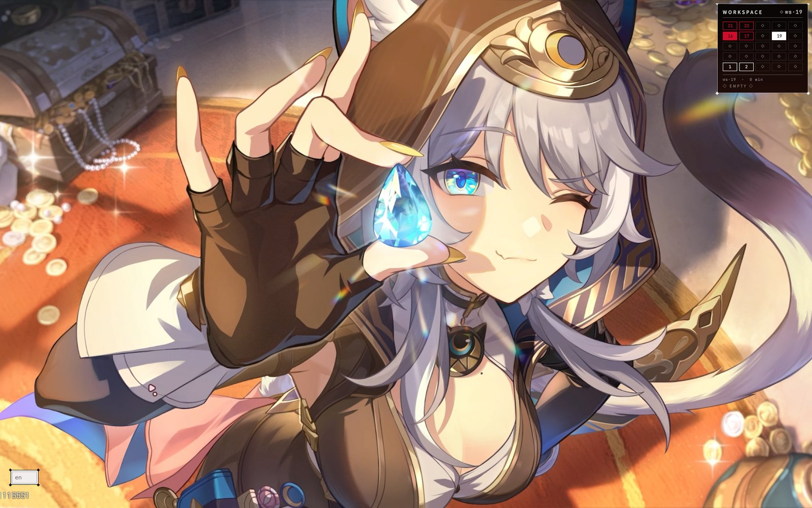
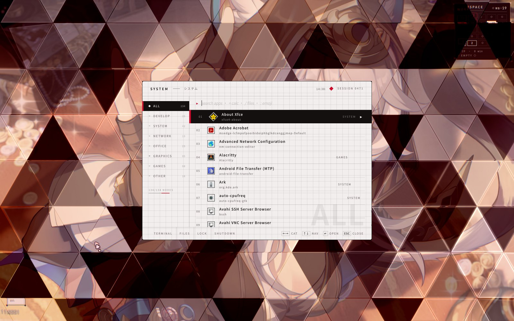
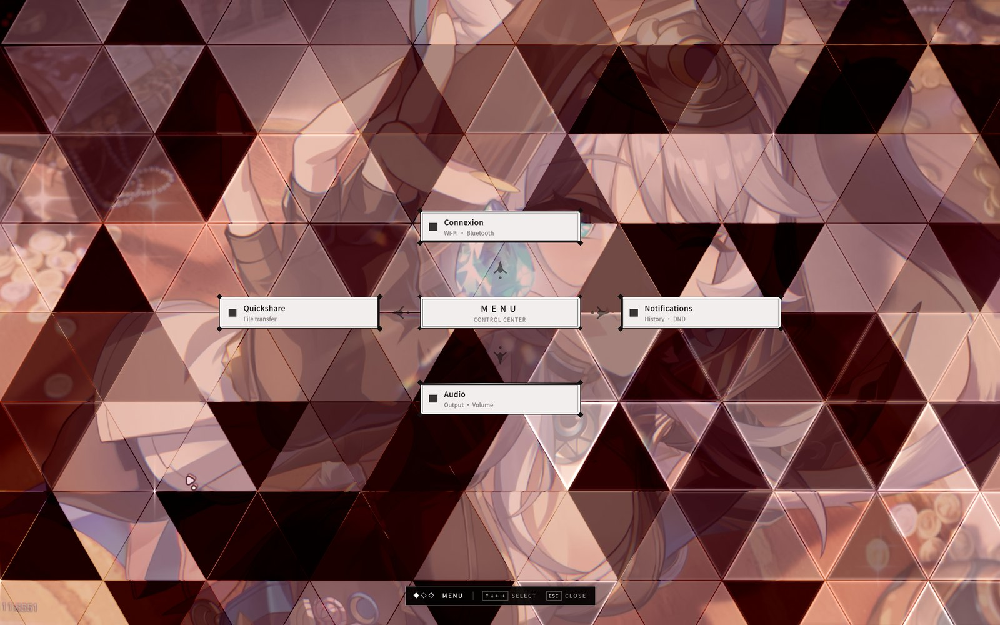
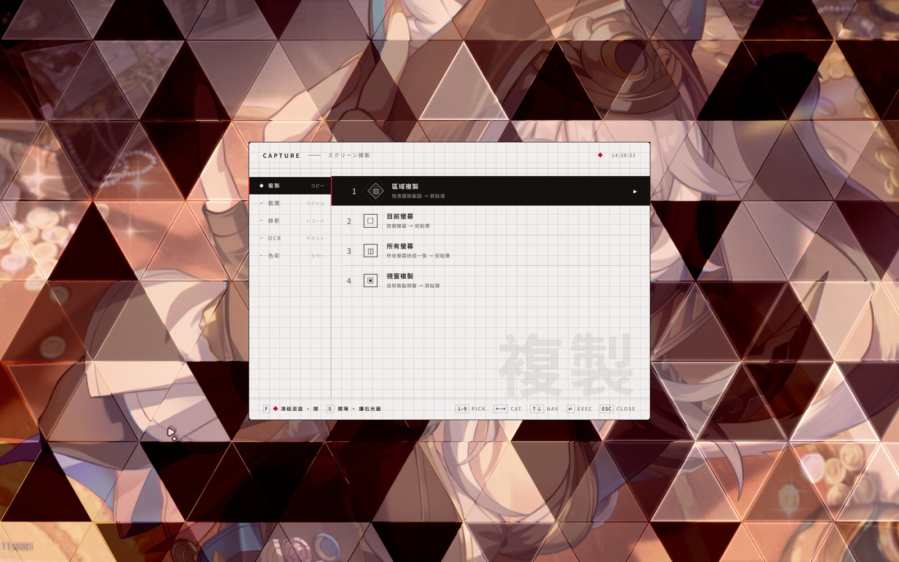
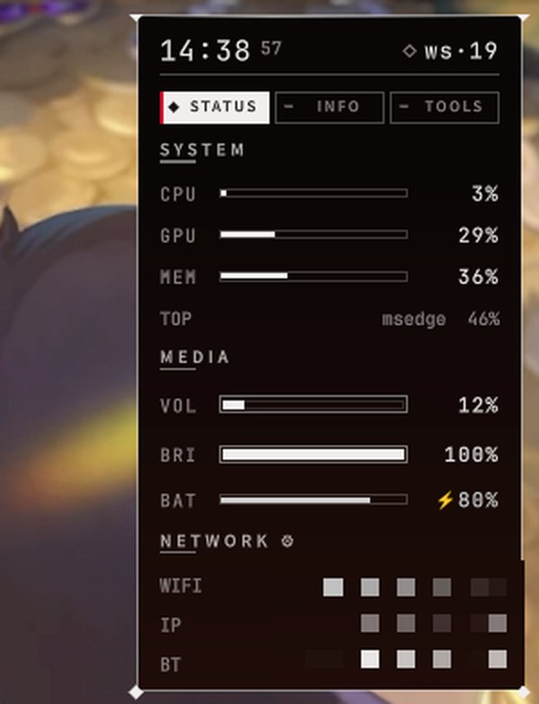
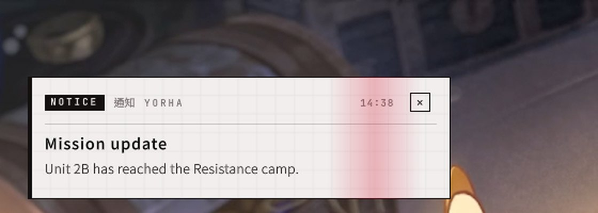
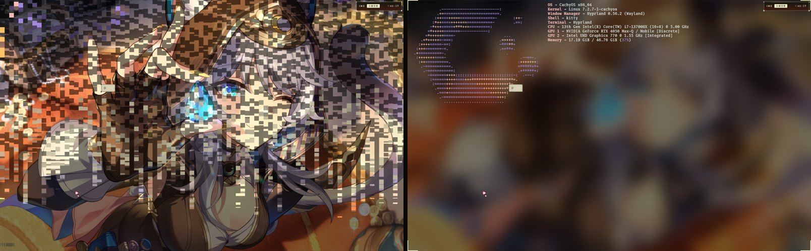
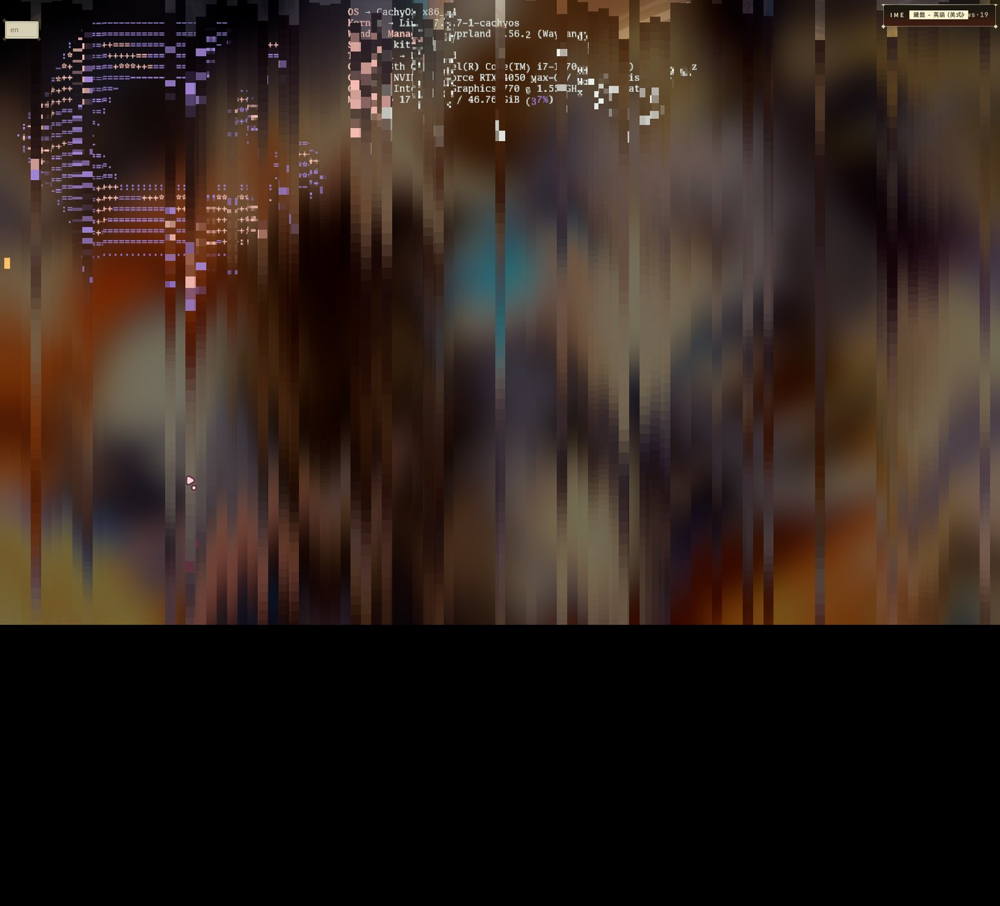
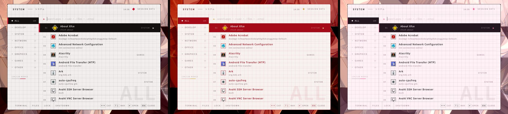

# NieR:Automata desktop — Quickshell + Hyprland dotfiles

A YoRHa-styled Wayland desktop: a [Quickshell](https://quickshell.org/) shell (QML) on
[Hyprland](https://hyprland.org/) with a Lua config. Paper-and-ink panels on a refracting
glass-triangle backdrop, diamond hit effects, windows that rain in pixel by pixel and melt
away, synced lyrics in a corner HUD, an input-method candidate window drawn by the shell,
and eleven colour themes that also recolour fcitx5 and the window borders.

> 以《尼爾：自動人形》為主題的 Hyprland + Quickshell 桌面。紙墨風格的面板、會折射的玻璃三角背景、
> 鑽石打擊特效、像素拼出／向下溶解的視窗動畫、HUD 同步歌詞、由 shell 繪製的輸入法選字框，
> 以及 11 套可同步到 fcitx5 與視窗邊框的配色主題。設定集中在 `quickshell/config/`，存檔即時生效。



## What's inside

| | |
|---|---|
|  | **Launcher** (`SUPER+R`): apps with their real icons, ranked by how well they match and how often you launch them. `=` or plain arithmetic is a calculator (qalc), `/name` searches files (fd), `:name` picks emoji and kaomoji. |
|  | **Control Center** (`SUPER+M`): a spatial cross menu. Wi-Fi and Bluetooth (native NetworkManager / BlueZ), audio output and volume, LAN / tunnel file sharing with a QR code (`qshare.py`), notification history. Every confirm has a hit-stop and a shock ring through the glass. |
|  | **Capture panel** (`Print`): copy / screenshot / record (wf-recorder) / OCR (tesseract) / colour pick, with region selection on a frozen frame, a magnifier and five open styles. |
|  | **Corner HUD**: parks off the right edge, slides in on hover. System, media, network, weather, calendar, todo, stopwatch; a 5×5 workspace grid (``SUPER+` ``); the volume / brightness / mic / Caps Lock / input-method OSD; a now-playing card and **synced lyrics** (lrclib + NetEase, works for Spotify, YouTube and bilibili in the browser). |
|  | **Notifications**: the daemon, popups with actions, and a history the Control Center reads in-process. |

**Window effects** (a small Hyprland plugin, `quickshell/hypr-plugin/imecaret`, tells the shell
where windows are): a new window's own pixels rain down into place, a closing one melts
downward, and NieR lock-on brackets snap onto the window that takes focus.




**Themes**: `nier` (default), `yorha-noir`, `lilac`, `mono`, `crimson`, `jirai`, `jirai-light`,
`aha`, `matcha`, `abyss`, `amber` — the launcher in nier / aha / jirai-light:



Also: a **clipboard** panel (`SUPER+SHIFT+V`: cliphist history with text / link / image
tabs, thumbnails and a full preview), an fcitx5 candidate window drawn by the shell (kimpanel bridge, placed at the caret by
the plugin, with typing sparks), a floating media player with a cava visualiser, a workspace
mover, and the [nierlock](https://github.com/xendak/nierlock) lockscreen as a submodule.

## Layout

```
quickshell/              ~/.config/quickshell — the shell
  shell.qml              entry point: lists the parts
  config/shell.conf      every option, live-reloaded
  config/themes/*.conf   colour themes
  widgets/               the parts (HUD, popups, notifications, IME panel, window effects…)
  components/            shared pieces (Popup base, glass backdrop, HitBurst, selectors, shaders)
  services/              shared data (audio, network, media, lyrics, notifications…)
  scripts/               helpers (theme sync, qshare, app list, IME bridge…)
  hypr-plugin/imecaret/  the Hyprland plugin (caret position, window/click events, open hold)
hypr/                    ~/.config/hypr — Hyprland, Lua config
dotfiles/                this README's screenshots, install.sh, the `dot` helper
```

## Install

Needs Hyprland ≥ 0.56 (Lua config) and Quickshell ≥ 0.3.

```sh
git clone --recursive https://github.com/llll2005/quickshell-and-others-dotfile ~/nier-dots
~/nier-dots/dotfiles/install.sh            # checks dependencies, links quickshell/ into ~/.config
~/nier-dots/dotfiles/install.sh --hypr     # …and hypr/ too (your current config is backed up first)
```

Anything already in `~/.config/quickshell` or `~/.config/hypr` is moved to a `*.bak-<date>`
folder, never deleted. The script also builds the Hyprland plugin (`make` in
`quickshell/hypr-plugin/imecaret`; rebuild it after every Hyprland update).

**Dependencies** — required: `hyprland`, `quickshell`, `python` (+ `python-gobject`),
`grim`, `wl-clipboard`, `imagemagick`. Used by features: `cliphist` (clipboard), `fd` and
`libqalculate` (launcher), `wf-recorder`, `tesseract` + data, `hyprpicker`, `swappy`
(capture), `cava` (player), `brightnessctl`, `fcitx5` (IME panel), `gcalcli` (calendar),
`python-qrcode` and optionally `cloudflared` (file sharing), `kitty`, `yazi`, `zenity`.
Fonts: *Share Tech Mono*; the CJK font is set per theme (`[font] cjk`).

### Using your own Hyprland config

Take these from `hypr/`:

- `core/autostart.lua`: start `qs`, the cliphist watchers and load the plugin
  (`hl.plugin.load(…/imecaret.so)`).
- `binds/dispatchers.lua`: the `qs ipc call …` binds below.
- `ui/theme.lua` / `ui/animations.lua`: they read `ui/qs_theme.lua`, which the shell writes,
  so borders follow the theme and Hyprland's close slide steps aside for the melt.

## Keys

| Key | |
|---|---|
| `SUPER+R` | launcher |
| `SUPER+M` | Control Center |
| `Print` / `SUPER+Print` | capture panel / stop recording |
| `SUPER+SHIFT+V` | clipboard |
| `SUPER+ALT+S` | settings: every feature switch, plus the helpers' status and repair |
| ``SUPER+` `` · ``SUPER+SHIFT+` `` · ``SUPER+CTRL+` `` | HUD workspace grid · stats · show / hide |
| `SUPER+SHIFT+L` · `SUPER+SHIFT+N` | lyrics on / off · now-playing card |
| `SUPER+P` | media player |
| `F4` | lockscreen (nierlock) |

Everything is also an IPC call: `qs ipc show` lists them, e.g. `qs ipc call theme set aha`.

## Configure

The **settings panel** (`SUPER+ALT+S`) switches every feature and adjusts the main options,
and shows whether the helpers the features need are running (the Hyprland plugin, the
cliphist watchers, fcitx5), with one-key repair. It writes to the same file:
`quickshell/config/shell.conf` holds every option, with comments; saving it applies at once:
the theme, HUD timing, backdrop look, effects (click bursts, window open / close / focus),
IME panel, lyrics, capture, notifications, player.

Themes are small INI files in `quickshell/config/themes/`; a theme lists only what it
changes. `qs ipc call theme set <name>` previews one, `reset` goes back.
`[sync]` in `shell.conf` decides whether fcitx5 and the Hyprland borders follow it.

## Not included

Third-party artwork isn't redistributed. To get it back, put your own files here:

- `quickshell/assets/cal/month1.jpg … month12.jpg`: the HUD calendar's month art
  (any 4:3-ish image; without them the calendar sits on the theme colour).
- `quickshell/assets/{2b,mai,amazon}.gif`: the companion sprites (`[companions] enabled`).
- `quickshell/assets/nier-arrow.png`: the Control Center's direction glyph (a drawn
  diamond and chevron stand in without it).

## Maintaining your own copy

My setup keeps the configs in place: a bare repo (`~/.dotfiles.git`) with `~/.config` as its
work tree, driven by `dotfiles/dot`, a `git` wrapper (`dot status`, `dot add …`, `dot commit`).
Untracked files stay hidden, so add new ones explicitly.

## Credits

- [Quickshell](https://quickshell.org/) and [Hyprland](https://hyprland.org/).
- [nierlock](https://github.com/xendak/nierlock) by xendak (submodule).
- Lyrics from [lrclib.net](https://lrclib.net/) and NetEase Cloud Music.
- Inspired by NieR:Automata (Square Enix / PlatinumGames); not affiliated.

Keywords: hyprland · quickshell · nier-automata · yorha · rice · dotfiles · wayland · qml · unixporn
